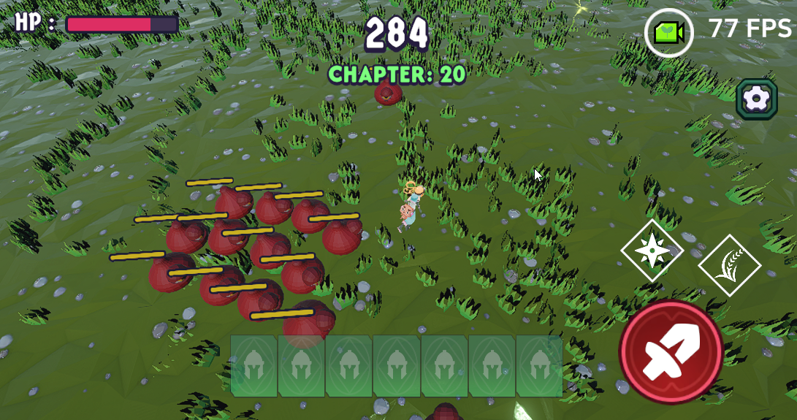
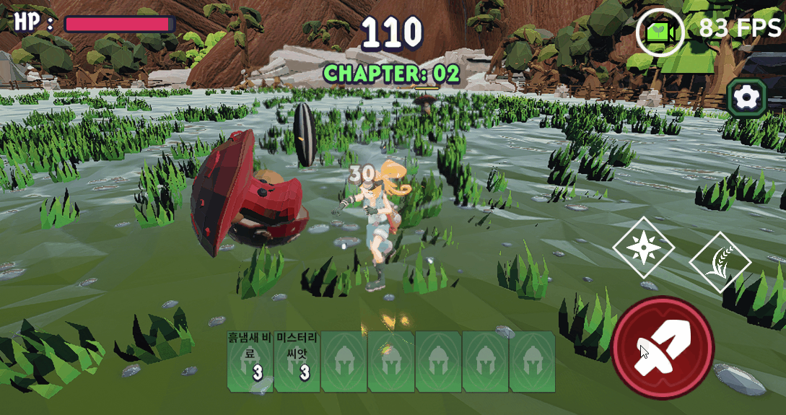

# Genome Slayer (게놈슬레이어)
> 모바일 3D 핵앤슬래시(웨이브/보스) + 농사/자원 성장 루프 기반의 짧은 세션 액션 게임

**Platform**: Android (Google Play)  
**Engine**: Unity 6 (URP)  
**Team**: 개발 1 / 기획 1  
**Dev 기간**: 2025.09 – 2025.10

🔗 Links  
- ▶ [Gameplay Video](https://www.youtube.com/watch?v=NZ1YHHvFfLc)
- 📦 [Google Play](https://play.google.com/store/apps/details?id=com.Kyungil.GenomeSlayer)

---

## TL;DR (10초 요약)
- **Core Loop**: 정비 → 전투(웨이브) → 정비 (짧은 세션에 최적화)
- **Data-driven**: 무기/적/웨이브/버프/이펙트/식물 등 **ScriptableObject 기반 테이블화**
- **WaveSO Timeline Spawn**: startTime/period/amount/isBoss 기반 스케줄 스폰 + **데이터 정합성 검증**
- **Save/Load 안정성**: Atomic write + backup recovery + 버전 마이그레이션 + (압축/암호화)
- **성능/UX**: ID별 오브젝트 풀링(Prewarm), BGM 크로스페이드, SFX/VFX 풀링, 모바일 카메라/인벤 UX 개선

---

## Gameplay

---

## Core Loop
- 총 20 웨이브
- 정비 시간에 포인트로 능력 강화
- 5의 배수 웨이브는 보스 웨이브

---

## Key Systems & Highlights

### 1) Data-driven Content Pipeline (ScriptableObject)
- 신규 콘텐츠 추가/밸런싱을 코드 수정 없이 처리
- 무기/적/웨이브/버프/이펙트/식물 데이터를 SO로 분리
#### 📁 관련 코드: [`ScriptableObject`](GenomeSlayer/Assets/Project/Scripts/ScriptableObject/)

### 2) WaveSO Timeline Spawn + Validation
- WaveSO에서 시간 기반 스폰(startTime/period/amount/isBoss) 정의
- 런타임에서 WavesManager가 스케줄 스폰 실행
- `OnValidate()`로 보스 스폰 규칙/수량 최소값 강제 (데이터 오류 사전 차단)
- `EstimateTotalSpawns()`로 난이도/부하 빠른 산정
#### 📁 관련 코드: [`Waves`](GenomeSlayer/Assets/Project/Scripts/ScriptableObject/Waves/)

### 3) Save/Load (안정성 중심)
- Atomic Write: `save.tmp`에 저장 후 main 교체
- Backup Recovery: `save.bak` 자동 복구
- Backward Compatibility: 구버전 JSON 감지 → 로드 후 즉시 마이그레이션 저장
- Security/Size: JSON → (압축) → Base64 암호화
#### 📁 관련 코드: [`SaveService.cs`](GenomeSlayer/Assets/Project/Scripts/SaveService.cs)

### 4) Wave Manager 통합 상태 관리 + 성능 보호
- BreakTime ↔ Wave 진행 상태 통합 관리
- maxEnemyCount 상한 + **ID별 Queue Pooling** + Prewarm
- 웨이브 종료 시 활성 적 회수/카운트 정리 + UI/플레이어 상태 리셋
#### 📁 관련 코드: [`WavesManager.cs`](GenomeSlayer/Assets/Project/Scripts/WavesManager.cs)

### 5) Audio Manager
- BGM 2채널 크로스페이드로 자연스러운 전환
- SFX는 AudioSource 풀링으로 동시 재생 안정화
- Mixer 파라미터를 Settings와 연동 (슬라이더 저장)
#### 📁 관련 코드: [`AudioManager.cs`](GenomeSlayer/Assets/Project/Scripts/AudioManager.cs)

### 6) Mobile UX
- 카메라: 드래그 회전/핀치 줌/더블탭 스냅 + UI 터치 차단
- 인벤: 롱프레스 이후 드래그로 드랍/폐기(오동작 방지)
#### 📁 관련 코드:
- 카메라 : [`CamHorizontalDrag.cs`](GenomeSlayer/Assets/Project/Scripts/CamHorizontalDrag.cs)
- 롱프레스 : [`QuickSlotDiscardHandler.cs`](GenomeSlayer/Assets/Project/Scripts/QuickSlotDiscardHandler.cs)

---

## My Role (개발 1 / 기획 1)
- 시스템 설계 및 구현: Wave / SaveLoad / Data-driven(SO) / Audio / VFX / UI&UX / Mobile Input 등
- 성능 최적화: Pooling, Prewarm, 상한 관리 등

---

## Contact
- Email: a2207624435@gmail.com
